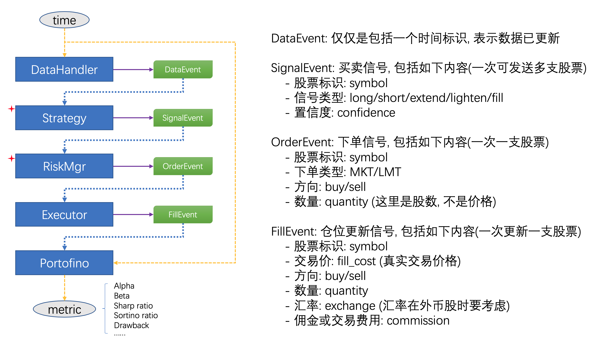

## 架构

#### 1. 基本架构
MyQuant是一个事件驱动的架构, 架构如下:

下面对每个组件说明:
- DataHandler: 处理数据, 如数据获取, 指标, 特征计算等. 通过timer定进调度, 调用dataHandler的update_bars()方法, 更新数据, 并发送DataEvent
- Stragety: 策略, 其中包括一系列`StragetyRule`, `StragetyRule`会根据历史与当前数据发送SignalEvent, 信号类型包括:
    - 开仓: Short/Long
    - 加/减仓: Extend/Lighten, 由于可以做空, 加仓不一定是买, 减仓不一定是卖
    - 平仓: Close, 平一个盈利仓称为止盈, 平一个亏损仓称为止损
- RiskMgr: 风险管理, 信号只说明了要买/卖什么, 但没有说明要买/卖多少. 风险控制就是根据当前仓位与风险策略决定买多少, 发送OrderEvent
- Executor: 执行交易的模块, 接受OrderEvent进行交易, 当交易成功时发送FillEvent
- Protofino: 计账的模块, 处理包括汇率, 佣金, 做空, 做多等复杂的资金流. 在每次数据更新前会更新Protofino. 基于这个模块可计算一系列指标.

#### 2. 交易过程与模块对应关系

股票交易通常有如下6个步聚:
- 市场: 决定买/卖什么, 对应Stragety
- 头寸规模: 买多少, 对应RiskMgr
- 入市: 什么时候操作, 对应Stragety
- 退出(止盈/止损): 对应Stragety

所以Stragety, RiskMgr是系统的核心.

#### 3. 处理冲突
对于一个DataEvent, Stragety中的不同StragetyRule独立发送信号(Signal), 这样有可能有信号冲突. 为了处理冲突, 将信号分为三类:
- 开仓信号: OpenLong/OpenShort
- 调仓信号: Extend/Lighten
- 平仓信号: Close

开仓信号不可能与调仓/平仓信号同时出现, 自成一类, 按如下规则选择:
- 按OpenLong/OpenShort投票来选, 得票多的获胜
- 如果票数相同, 则按平均置信度来选, 大的获胜
- 如果还选不出来, 则放弃这个symbol

对于调仓/平仓信号, 平仓信号优先级大于调仓信号. 如果同为调仓信号, 则按如下方式选择:
- 按Extend/Lighten投票来选, 得票多的获胜
- 如果票数相同, 则按平均置信度来选, 大的获胜
- 如果还选不出来, 则放弃这个symbol